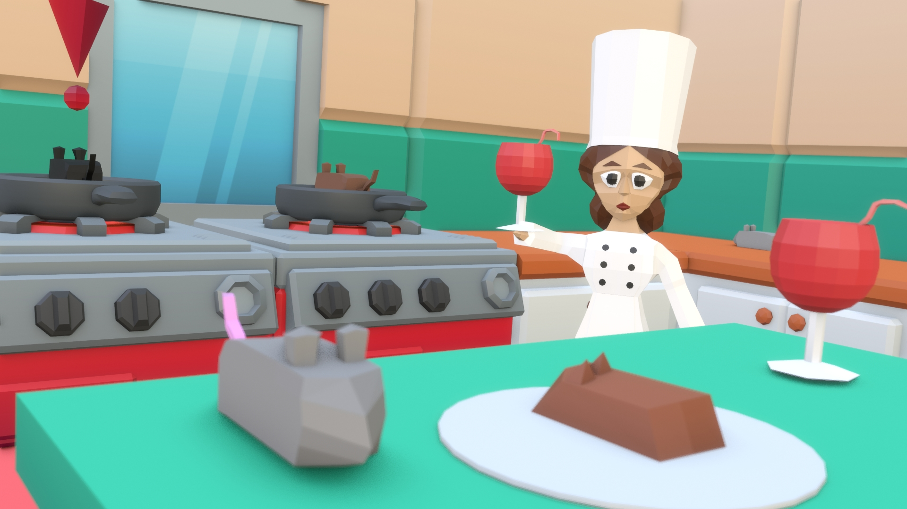
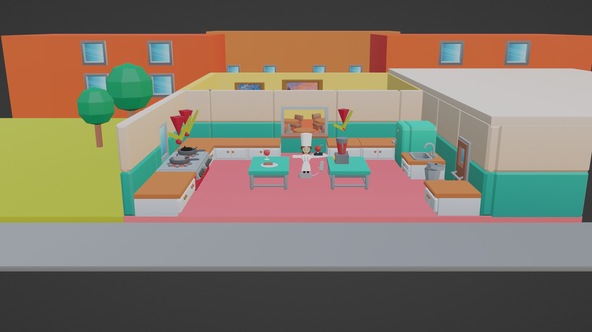
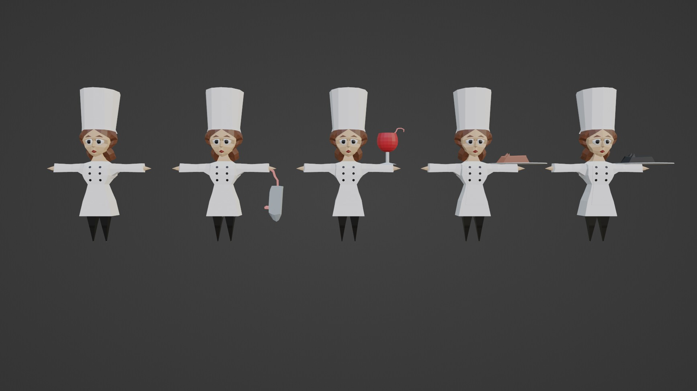
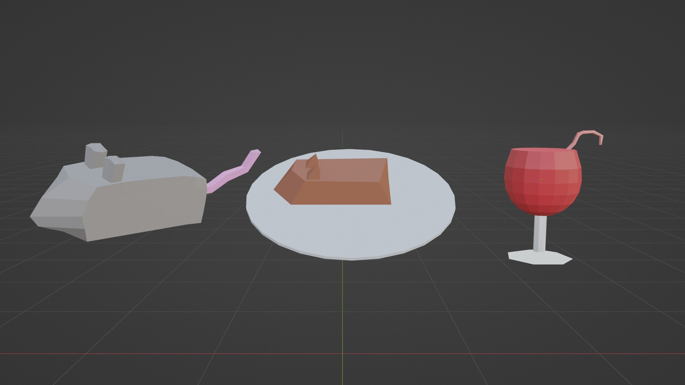
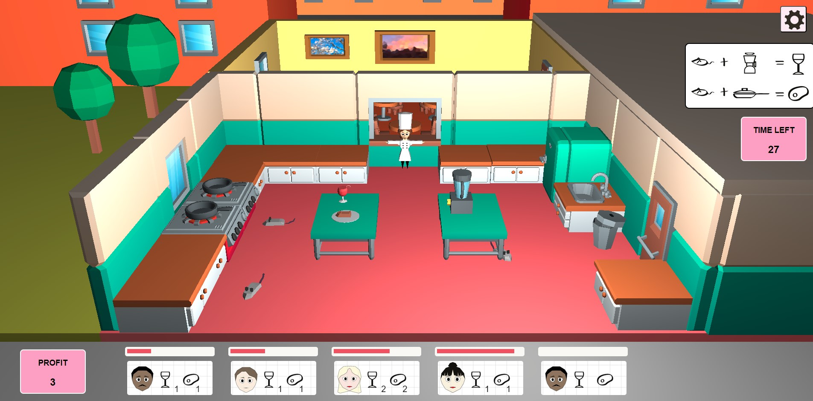

# Too Many Rats in the Kitchen - WebGPU



**Too Many Rats in the Kitchen** is a third-person simulation game where players take on the role of a chef battling a rat infestation in their restaurant kitchen. The goal is to eliminate rats and prepare food for the restaurant's guests, balancing between cooking and managing the chaos.

## Authors
- Clara Jantson-Köstner
- Brina Plestenjak ([BriBerrry](https://github.com/BriBerrry))
- Ana Poklukar ([anapoklukar](https://github.com/anapoklukar))

## Table of Contents
- [Overview](#overview)
- [Game Mechanics](#game-mechanics)
- [World Description](#world-description)
- [Objects](#objects)
- [Game Time](#game-time)
- [Music and Sound](#music-and-sound)
- [Gameplay](#gameplay)
- [Installation](#installation)

## Overview
In **Too Many Rats in the Kitchen**, the restaurant has been overrun by rats that have consumed all the food supplies. The player must exterminate the rats and prepare meals for impatient customers under time pressure.

- **Game Genre**: Simulation, Cooking
- **Technologies**: WebGPU, JavaScript, HTML, CSS
- **Target Audience**: Suitable for anyone

## Game Mechanics
- **Objective**: Eliminate rats while managing kitchen tasks to serve restaurant guests.
- **Controls**: 
  - `W, A, S, D` for movement
  - `Spacebar` for interaction with objects and rats
- **Time Limit**: The game lasts for 3 minutes, representing a day in the restaurant. Guests will wait a maximum of 40 seconds for their food.

## World Description
The game takes place in a 2D kitchen where the chef (player character) moves and interacts with kitchen appliances and rats. The setting is a cartoonish, low-poly style kitchen.

### Key Locations

- **Stove Area**: Located on the far left, where the player can place a rat in a pan and fry it.
- **Blender**: In the middle of the kitchen, the chef can use the blender to turn rats into wine.
- **Window**: Providing a view into the dining area, where the chef can serve food to guests.
- **Waste Area**: Located on the far right, where players can discard burnt or contaminated food.



## Objects

We used a combination of custom 3D models and assets from the **[KayKit: Restaurant Bits](1https://kaylousberg.itch.io/restaurant-bits)** pack. Models were optimized with UV maps and reduced texture sizes to improve game performance. The chef and rats were simple models (see figures below) with the rats having different states: alive, made into wine, cooked or burnt.





## Game Time

The game simulates a single day in the restaurant, lasting about **3 minutes**. Guests wait approximately **40 seconds** for their meals, and each dish takes about **5 seconds** to prepare (without any rat-induced delays).

## Music and Sound

The game features **["George Street Shuffle"](https://incompetech.com/music/royalty-free/index.html?isrc=USUAN1300035)** by Kevin MacLeod as background music, creating a prestigious restaurant ambiance. [Sound effects](https://freesound.org) include beeping for the stove, blender mixing, frying sounds, cash register chimes for completed orders, a bell for new orders, and clicking in the UI. All audio is sourced from CC0 or Creative Commons Zero licenses.

## Gameplay

Players control the head chef using WASD for movement and spacebar to interact with objects. The goal is to prepare and serve dishes quickly while managing a rat infestation in the kitchen. Players can kill rats, fry them, prepare wine, deliver meals, and discard failed dishes. Successful orders earn money and increase the score. The game lasts three minutes, challenging players to balance cooking and rat control efficiently.



## Installation
1. Clone the repository:
    ```bash
    git clone https://github.com/anapoklukar/too-many-rats-in-the-kitchen-webgpu.git
    ```
2. Navigate to the project directory:
    ```bash
    cd code
    ```
3. Start a local server:
    ```bash
    python -m http.server
    ```
4. Open your browser and go to `http://localhost:8000` to start the game.
